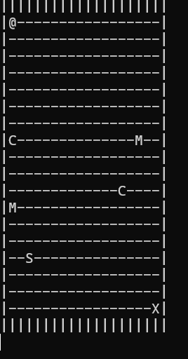
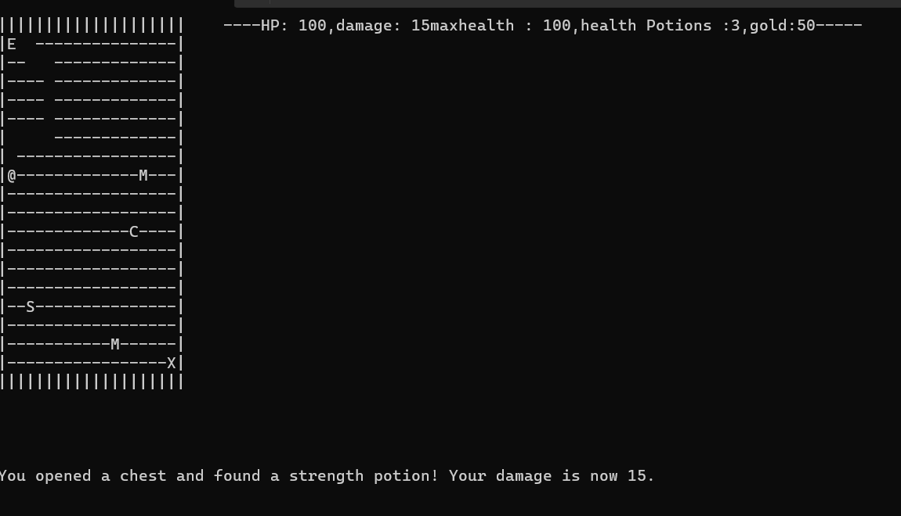
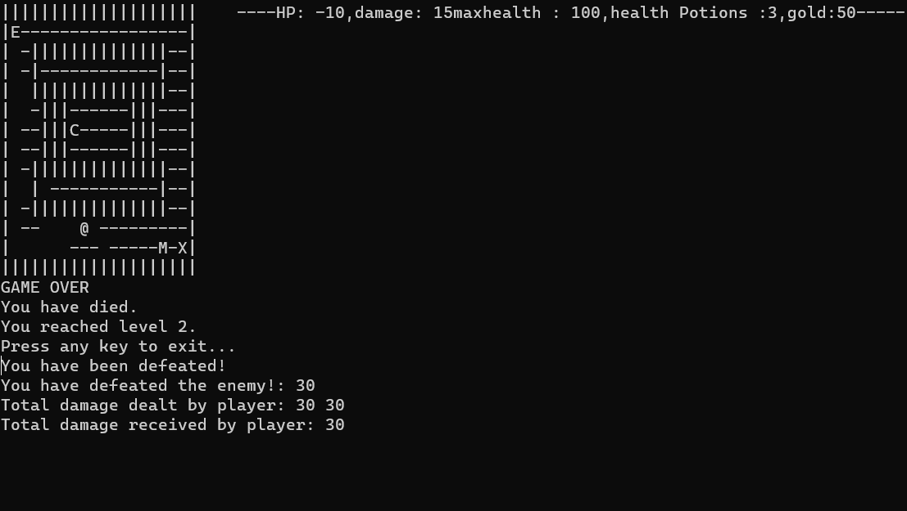
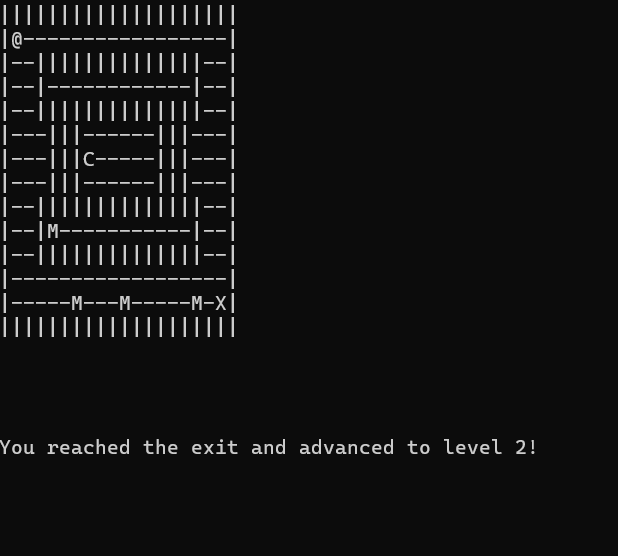
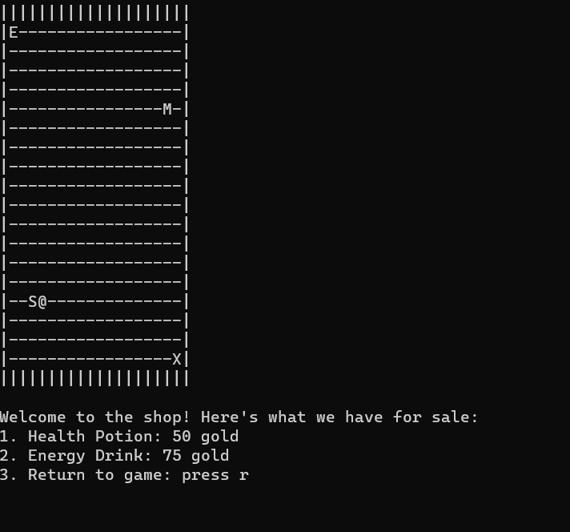
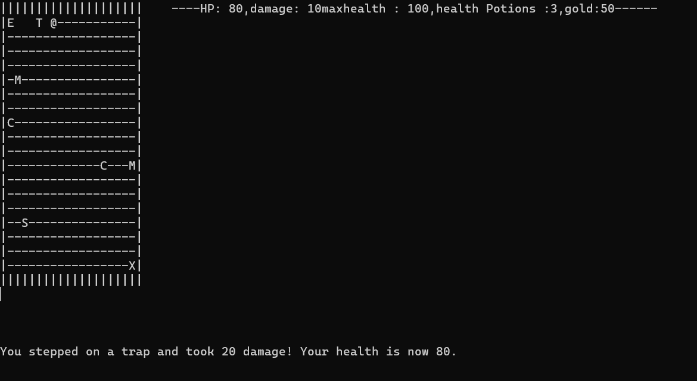
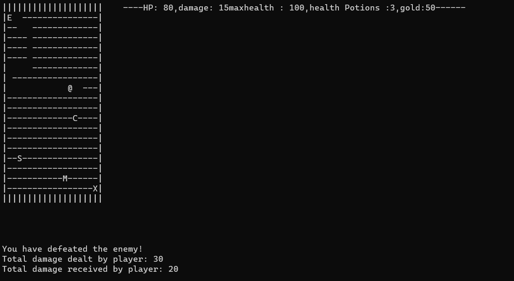
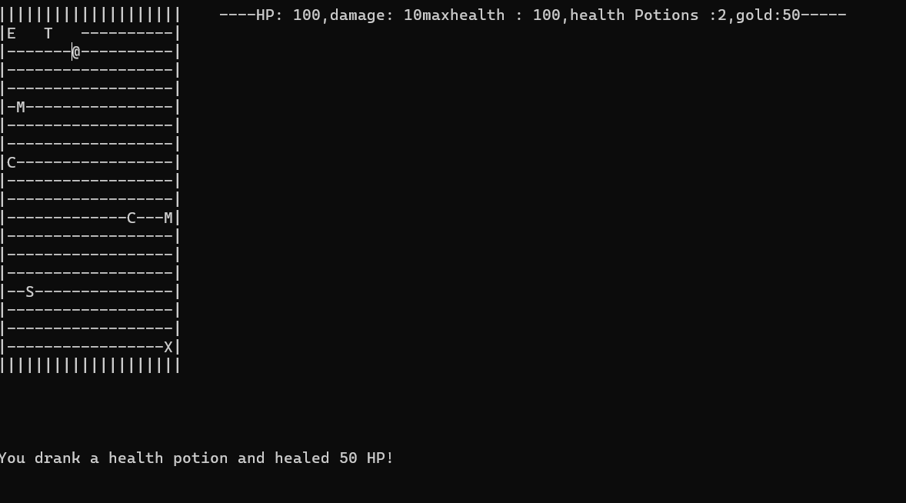

# MazeMaster: Navigate, Fight, Survive! 🌀

## Description 

MazeMaster is an enthralling maze navigation game, meticulously crafted in C#. Embark on a journey with the `@` player through multifaceted mazes, encountering a variety of challenges and surprises. Navigate walls, combat monsters, dodge traps, shop for potions, and find your way to the exit to advance to the subsequent level. With continuous levels providing endless fun and escalating difficulty, the adventure never ends!

## Key Features 🗝️

- **Intricate Mazes:** Navigate through mazes of increasing complexity and challenge.
- **Dynamic Player Navigation:** Move the player `@` using the `W`, `A`, `S`, and `D` keys.
- **Monsters Encounters:** Engage in combat with `M` monsters lurking in the maze.
- **Hidden Traps:** Stay alert for `T` traps, revealed only when stepped upon.
- **Shopping for Supplies:** Visit `S` shops to purchase valuable health and strength potions.
- **Continuous Levels:** Progress to the next level upon reaching `X`, the maze exit.

## Game Elements 🎮

- `@` - Player
- `E` - Maze Entrance
- `-` - Walkable Path
- `|` - Wall
- `M` - Monster
- `S` - Shop
- `T` - Trap (Hidden)
- `X` - Maze Exit
- `C` - Chest (Contains health potions and/or gold)

## Controls 🕹️

- **Move:** W, A, S, D
- **Heal:** H (Utilizes a health potion from the inventory)

## Screenshots 📸

*Fig 1. The initial state of the maze, marked with `E`, the entrance.*

*Fig 2. The player discovers and opens a chest, acquiring health potions and gold.*

*Fig 3. A grievous moment as the player falls to the maze's peril.*

*Fig 4. A moment of triumph as the player reaches `X`, advancing to the next level.*

*Fig 5. The player stopping by `S`, the shop, to procure essential supplies.*

*Fig 6. The player unwittingly steps on a hidden trap `T`.*

*Fig 7. The player encounters and battles with `M`, a maze monster.*

*Fig 7. The player can press H to use heal potions and heal

## Installation & Play 🛠️

How to Run MazeMaster 🚀
Prerequisites
Install Visual Studio:
Download and install Visual Studio if not already installed.
During installation, make sure to select the ".NET desktop development" workload.
Clone the Repository
Clone from GitHub:

Click the green "Code" button on the GitHub repository page.
Copy the HTTPS URL.
Open Visual Studio.
Select "Clone a repository" under "Get started".
Paste the copied URL in the "Repository location" field.
Choose a local path where you want to clone the repository and click the "Clone" button.
OR

Alternatively, you can use Git from the command line to clone the repository:
sh
Copy code
git clone [Repository_URL]
Replace [Repository_URL] with the URL you copied.
Open and Run the Game
Open the Solution:

In Visual Studio, navigate to the local path where you cloned the repository.
Open the .sln solution file.
Build the Solution:

Click on "Build" in the top menu.
Select "Build Solution" from the dropdown menu.
Run the Game:

Click on the green "Start" button, or press F5 on your keyboard to run the game.
Play and Enjoy:

Navigate, fight, and survive through the thrilling mazes of MazeMaster!

